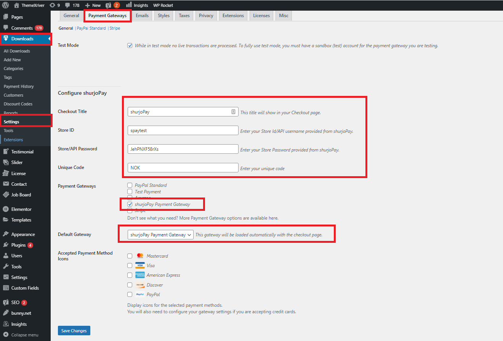

# shurjoPay For Easy Digital Downloads (EDD)

> Easy Digital Downloads plugin for shurjoPay payment gateway.

## Getting Started

### Prerequisites

1. Wordpress V5.2.*
2. Easy Digital Downloads V2.9.*
3. cURL php extension.

### Installation

1. Download zip file or Clone the repository.
2. Directly upload zip file to Wordpress admin panel ```Plugins > Add New > Upload Plugin``` button.
3. Activate the plugin through the 'Plugins' menu in admin panel.
4. If you unable to do above steps Unzip if downloaded zip file.
5. Move the whole directory to ```/wp-content/plugins/```
6. Activate the plugin through the 'Plugins' menu in admin panel.

### Configuration

1. Open Wordpress Admin Panel.
2. Navigate to ```Downloads > Settings > Payment Gateways``` tab.

* 

3. Scroll down the page, In the **Configure shurjoPay** section input your **Checkout Title**, **Store ID/Username**, **Store Password** provided from shurjoPay Operation.

> Note: Don't use  your merchant panel user id & password in the **Store ID**, **Store Password** field.

4. Must input **Checkout Title** otherwise it will not show any title in checkout page.
5. Setup is complete. Check if everything is working properly.

#### Note: For live mode uncheck ```Test Mode``` and use your Live Store ID & Password.

## FAQ

### What is Easy Digital Downloads?
> In their words "From eBooks, to WordPress plugins, to PDF files and more, we make selling digital products a breeze. Easy Digital Downloads is simple to use and free to download." [More](https://easydigitaldownloads.com/) 

### What is shurjoPay?
> shurjoPay is the first payment gateway in Bangladesh opening doors for merchants to receive payments on the internet via their online stores.

### What is a Payment Gateway?
> Payment Gateway is a service that allows merchant to accept secure credit card transactions online. It essentially connects a merchant website to a transaction processor like bank to take payment from a customer for an order.

## Contributors

* Nazmus Shahadat
* Email Us: shurjopahy@shurjomukhi.com.bd (For any query)
* More info: https://www.shurjopay.com.bd

© 2021 shurjoPay ALL RIGHTS RESERVED
